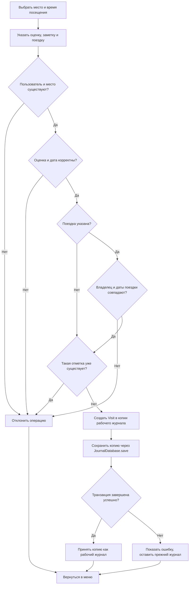

# Отчет по практической работе 2

## Общие сведения

Дисциплина: Технологии разработки приложений на базе фреймворков

Тема индивидуального проекта: Система учета посещенных мест

Рабочее название: Visited Places

Группа: не указано

ФИО студента: не указано

Год выполнения: 2026

## Цель работы

Цель ПР2 - провести анализ требований к системе учета посещенных мест, описать
сценарии использования и подготовить план разработки монолитного веб-приложения.
Текущая реализация представляет собой рабочее консольное приложение на Python
с интерактивным меню и постоянным SQLite-хранилищем. JSON используется для
начального заполнения и программного импорта/экспорта. Веб-интерфейс, авторизация и деплой
относятся к проектируемым этапам.

## Основы веб-разработки

В будущей монолитной веб-версии технологии распределяются следующим образом:

- HTML задает структуру страниц: каталог мест, формы поездок и отметок;
- CSS отвечает за расположение элементов, читаемость и адаптацию форм к экрану;
- JavaScript может обновлять фильтры и проверять заполнение формы до отправки;
- веб-сервер принимает HTTP-запросы, передает их приложению и возвращает ответ.

При просмотре истории браузер отправляет GET-запрос. Сервер определяет
пользователя по сессии, получает его отметки и возвращает HTML-страницу.
При добавлении отметки форма отправляет POST-запрос; сервер повторно проверяет
данные и права, сохраняет запись и перенаправляет пользователя к истории.
Проверки JavaScript дополняют серверную валидацию. В консольном приложении
эти страницы и HTTP-обработчики пока не реализованы.

## Методы сбора и анализа требований

При подготовке проекта применены анализ предоставленных методических
материалов, декомпозиция предметной области на четыре сущности, описание
сценариев использования, диаграмма добавления отметки и проверка бизнес-правил
автоматическими тестами. Требования документируются в таблицах F1-F17 и NF1-NF7.

Для уточнения требований в дальнейшем подходят следующие методы:

- анализ предметной области: как пользователи ведут списки мест, поездок и
  заметок;
- интервью с потенциальными пользователями: какие данные они хотят сохранять и
  какие отчеты видеть;
- анализ аналогов: карты, заметки, travel-журналы, чек-листы поездок;
- прототипирование: уточнение логики на сценариях интерактивного меню;
- тестовые сценарии: проверка добавления пользователей, мест, поездок и
  отметок.

Проведение интервью с пользователями и сравнительное исследование конкретных
сервисов не подтверждены; они включены в план уточнения требований.

## Пользователи и роли

| Роль | Описание |
| --- | --- |
| Пользователь | Ведет личный журнал посещенных мест |
| Администратор каталога | В будущей веб-версии может проверять и объединять дубли мест |
| Разработчик | Поддерживает модели, сервисную логику, хранение и тесты |

В консольном приложении выбирается локальный профиль пользователя. Выбор
профиля не подтверждает личность: любой оператор может выбрать любой `user_id`.
Роли доступа, регистрация, пароли и сессии относятся к будущей веб-версии.

## Функциональные требования

| ID | Требование | Статус |
| --- | --- | --- |
| F1 | Добавление и изменение пользователя с именем и email | реализовано в `TravelJournal.add_user`, `update_user` |
| F2 | Добавление и изменение места с названием, городом, страной и категорией | реализовано в `TravelJournal.add_place`, `update_place` |
| F3 | Добавление поездки пользователя с датами начала и окончания | реализовано в `TravelJournal.add_trip` |
| F4 | Добавление отметки о посещении места | реализовано в `TravelJournal.add_visit` |
| F5 | Изменение места, времени, поездки, оценки и заметки отметки | реализовано в `TravelJournal.update_visit` |
| F6 | Удаление отметки выбранного профиля с подтверждением | реализовано в `TravelJournal.remove_visit` и консольном меню |
| F7 | Просмотр отметок пользователя, при необходимости по конкретной поездке | реализовано в `TravelJournal.list_visits` |
| F8 | Поиск мест по запросу | реализовано в `find_places` |
| F9 | Сортировка мест по названию | реализовано в `sort_places_by_name` |
| F10 | Расчет статистики посещений | реализовано в `build_travel_statistics` |
| F11 | Загрузка и сохранение JSON для начальных данных и программного импорта/экспорта | реализовано в `storage.py` |
| F12 | Постоянное SQLite-хранилище и SQL-схема | реализовано в `JournalDatabase` и `database/schema.sql` |
| F13 | Изменение названия и дат поездки без конфликта с существующими посещениями | реализовано в `TravelJournal.update_trip` и пункте 12 меню |
| F14 | Удаление поездки с подтверждением без удаления посещений | реализовано в `TravelJournal.remove_trip` и пункте 13 меню |
| F15 | Интерактивное меню, выбор и добавление локальных профилей | реализовано в `ConsoleApplication.run` |
| F16 | Начальная загрузка JSON только при отсутствии базы и продолжение работы из SQLite | реализовано в `main.py` |
| F17 | Транзакционное сохранение изменений, обработка ошибок ввода и корректный выход | реализовано в `ConsoleApplication._commit`, `run` и `JournalDatabase.save` |

## Нефункциональные требования

| ID | Требование | Описание |
| --- | --- | --- |
| NF1 | Корректность данных | Проверка дат, рейтингов, внешних ключей и дублей |
| NF2 | Читаемость кода | Модульная структура, типизация, понятные имена |
| NF3 | Тестируемость | Модели, сервис, CLI и SQLite-хранилище проверяются отдельно |
| NF4 | Переносимость | Приложение запускается на Python 3.10+; SQLite входит в стандартную библиотеку, внешний сервер БД не нужен |
| NF5 | Расширяемость | Предметная модель отделена от SQLite, JSON-функций и интерфейса |
| NF6 | Безопасность | Локальные профили не являются авторизацией; для веб-версии нужны сессии, HTTPS и защита данных |
| NF7 | Производительность | Журнал загружается в память, снимок сохраняется транзакционно; для роста нужны выборочные запросы и пагинация |

Изменение выполняется на глубокой копии рабочего журнала. После успешного
`JournalDatabase.save` приложение принимает новое состояние; при ошибке
рабочий журнал остается прежним. Ошибки операции показываются в терминале,
после чего меню продолжает работать. EOF и `Ctrl+C` завершают цикл без traceback.

## Основные сценарии использования

### UC1. Добавить пользователя

Актор: оператор консольного приложения.

Основной поток:

1. Вводятся имя и email.
2. Сервис проверяет, что email не дублируется.
3. Создается объект `User`.
4. Пользователь добавляется в копию журнала, копия сохраняется в SQLite.
5. После успешного сохранения приложение принимает новый журнал.

Альтернативный поток: если email уже существует, операция завершается ошибкой.

### UC2. Добавить место

Актор: пользователь.

Основной поток:

1. Вводятся название, город, страна и категория.
2. Сервис проверяет, что такое место еще не добавлено в каталог.
3. Создается объект `Place`.
4. Измененный журнал сохраняется транзакционно и становится рабочим состоянием.

Дубль определяется по сочетанию названия, города и страны.

### UC3. Добавить поездку

Актор: пользователь.

Основной поток:

1. Оператор выбирает локальный профиль через меню.
2. Вводит название поездки, дату начала и дату окончания.
3. Сервис проверяет существование пользователя и корректность диапазона дат.
4. Создается объект `Trip`.
5. Новый журнал сохраняется в SQLite; приложение принимает его после успешного
   завершения транзакции.

### UC4. Добавить отметку

Актор: пользователь.

Основной поток:

1. Пользователь выбирает место и дату посещения.
2. При необходимости указывает поездку, рейтинг и заметку.
3. Сервис проверяет пользователя, место, поездку и дату.
4. Сервис проверяет отсутствие дубля по `user_id`, `place_id`, `visited_at`.
5. Создается объект `Visit`.
6. Копия журнала с новой отметкой сохраняется в SQLite.
7. После успешного сохранения приложение заменяет рабочий журнал этой копией.

Альтернативные потоки:

- рейтинг вне диапазона 1..5 отклоняется;
- отметка вне дат выбранной поездки отклоняется;
- поездка другого пользователя отклоняется;
- ошибка сохранения оставляет прежний рабочий журнал; выводится сообщение,
  затем меню предлагает следующую операцию.

### UC5. Изменить отметку

Актор: оператор выбранного локального профиля.

Основной поток:

1. Оператор выбирает отметку по `visit_id`; `user_id` берется из выбранного профиля.
2. Сервис проверяет, что отметка принадлежит пользователю.
3. Проверяются и обновляются место, дата и время, поездка, `rating` и `note`.
4. Копия журнала сохраняется в SQLite и принимается приложением после успеха.

В консольном вводе пустые поля сохраняют текущие значения. `0` в поле поездки
или оценки преобразуется в `None`, заметка `-` очищается. Эти обозначения
обрабатывает CLI; в сервис `update_visit` передаются подготовленные значения.
Изменение не может создать дублирующую отметку, использовать чужую поездку
или вывести посещение за ее даты. При ошибке исходные поля не меняются.
Место редактируется в пункте `16`, выбранный профиль - в пункте `17`;
уникальность места и email проверяется до сохранения.

### UC6. Посмотреть статистику

Актор: пользователь.

Основной поток:

1. Пользователь выбирает свой журнал.
2. Система фильтрует отметки по `user_id`.
3. Система считает количество отметок, уникальных мест, городов, стран,
   поездок и средний рейтинг.

### UC7. Удалить отметку

Актор: оператор выбранного локального профиля.

1. Пользователь выбирает отметку по `visit_id`.
2. Оператор подтверждает удаление. Без подтверждения данные остаются прежними.
3. `TravelJournal.remove_visit` проверяет существование пользователя и
   принадлежность отметки переданному `user_id`.
4. Отметка удаляется из копии журнала.
5. `ConsoleApplication._commit` сохраняет копию через `JournalDatabase.save`.
   Рабочее состояние меняется только после успешной транзакции.

Подтверждением в CLI считаются `д`, `да`, `y` и `yes`; другие ответы отменяют
удаление. Это правило действует также для удаления поездки.

Если отметка не найдена или принадлежит другому пользователю, операция
отклоняется. В веб-версии `user_id` должен поступать из подтвержденной сессии.

### UC8. Просмотреть историю поездки

Актор: пользователь.

1. Пользователь выбирает свою поездку.
2. `TravelJournal.list_visits(user_id, trip_id)` проверяет владельца поездки.
3. Система возвращает отметки выбранной поездки от новых к старым.

Для просмотра всей личной истории `trip_id` не передается. Пустая история
возвращается как пустой список.

### UC9. Изменить поездку

Актор: оператор выбранного локального профиля.

1. Оператор выбирает пункт `12` и свою поездку.
2. Вводит новое название и даты начала и окончания.
3. `TravelJournal.update_trip` проверяет владельца, формат и диапазон дат,
   а также даты всех связанных посещений.
4. Если существующая отметка окажется вне нового диапазона, изменение
   отклоняется. Иначе копия журнала сохраняется и становится рабочей.

Пустой ввод названия или даты в консольном меню сохраняет текущее поле поездки.

### UC10. Удалить поездку

Актор: оператор выбранного локального профиля.

1. Оператор выбирает пункт `13`, поездку и подтверждает удаление.
2. `TravelJournal.remove_trip` проверяет принадлежность поездки профилю.
3. Поездка удаляется из копии журнала, ее отметкам присваивается `trip = None`.
4. Копия сохраняется в SQLite. Посещения, оценки и заметки остаются в истории.

### UC11. Выбрать локальный профиль

1. Оператор открывает пункт `10` и выбирает пользователя из списка.
2. История, поездки и статистика показываются для выбранного профиля.
3. При следующем запуске исходно выбирается первый пользователь журнала.

Пароли и подтверждение личности отсутствуют. Проверка владельца обеспечивает
согласованность данных, а не защиту от оператора, выбравшего чужой профиль.

### UC12. Продолжить работу после перезапуска

1. `main.py` принимает `--data-dir PATH`; по умолчанию это `data/` рядом с `main.py`.
2. Если `journal.sqlite3` существует, данные загружаются только из него.
3. Если базы нет, все четыре JSON-файла загружаются как начальный журнал.
   При отсутствии всех четырех файлов создается пустой журнал; неполный
   JSON-набор приводит к ошибке запуска без автоматического восстановления.
4. Новая база создается через `JournalDatabase.initialize` по схеме версии 1.
5. В пустом журнале оператор вводит первого пользователя, затем открывается
   интерактивное меню. Успешные изменения сохраняются для следующего запуска.

## Диаграмма сценария UC4

## План разработки консольного приложения

Ниже приведен пример учебного графика. Длительность дана ориентировочно и может
меняться в зависимости от требований преподавателя и объема проверки.

| Этап | Оценочная длительность | Зависимость | Роль/ресурс | Критерий завершения |
| --- | --- | --- | --- | --- |
| 1. Анализ предметной области и требований | 0.5 дня | нет | аналитик, README, отчет ПР2 | описаны сущности, роли, функциональные и нефункциональные требования |
| 2. Проектирование модели данных | 0.5 дня | этап 1 | аналитик, backend-разработчик | определены `User`, `Place`, `Trip`, `Visit`, связи и ограничения |
| 3. Реализация классов сущностей | 1 день | этап 2 | backend-разработчик, Python 3.10+ | классы созданы, есть валидация полей и сериализация |
| 4. Реализация сервиса журнала | 1 день | этап 3 | backend-разработчик | `TravelJournal` выполняет операции с отметками и поездками, сохраняет согласованность связей |
| 5. Реализация JSON-функций и начальных данных | 0.5 дня | этапы 3-4 | backend-разработчик, каталог `data/` | начальный журнал загружается и экспортируется без потери связей |
| 6. Реализация поиска, сортировки и статистики | 0.5 дня | этапы 3-5 | backend-разработчик | поиск мест и персональная статистика возвращают ожидаемые значения |
| 7. Подготовка SQL-схемы SQLite | 0.5 дня | этап 2 | backend-разработчик, `sqlite3` | DDL содержит таблицы, ключи, ограничения, индексы и триггеры |
| 8. Подключение SQLite-хранилища | 1 день | этапы 4-5, 7 | backend-разработчик, `JournalDatabase`, `sqlite3` | `initialize`, `load`, `save` работают с четырьмя коллекциями, сохранение транзакционно |
| 9. Интерактивное меню и запуск | 1 день | этапы 4-6, 8 | backend-разработчик, `ConsoleApplication`, `main.py` | доступны пункты 0-17, `--data-dir`, обработка ошибок и корректный выход |
| 10. Автоматические и пользовательские проверки | 1 день | этапы 3-9 | тестировщик, `pytest`, терминал | проверены сервис, JSON, схема, SQLite, CLI, запуск и сохранение после перезапуска |
| 11. Документация | 0.5 дня | этапы 1-10 | аналитик, разработчик | README и отчеты соответствуют реализации и фактическим результатам проверок |
| 12. Будущая веб-версия | по отдельному плану | этапы 1-11 | backend, frontend, тестировщик | подготовлены требования к монолитному веб-приложению |

Рабочее консольное приложение и SQLite-хранилище реализованы. Интеграционная
проверка текущей версии: `pytest==8.3.3` - `152 passed`, `flake8==7.1.1` -
без замечаний.

## План монолитного веб-приложения

Будущая веб-версия может быть реализована как монолитное приложение:

- backend: Python и веб-фреймворк;
- база данных: SQLite на учебном этапе, затем PostgreSQL при росте нагрузки;
- frontend: серверные шаблоны или легкий клиентский интерфейс;
- авторизация: регистрация, вход, сессии, разграничение доступа по владельцу;
- страницы: список мест, карточка места, поездки, отметки, статистика,
  форма добавления отметки.

Веб-интерфейс и HTTP-обработчики остаются следующим этапом развития рабочего
консольного приложения.

### Учебный график веб-версии

Ниже приведен отдельный план монолитного веб-приложения на основе требований
F1-F17. Это оценка будущих работ, а не сведения о выполненных этапах. Дни
отсчитываются от начала разработки веб-версии; предполагается последовательное
выполнение с распределением задач между указанными ролями.

| Этап | Рабочие дни | Зависимость | Ответственные и ресурсы | Критерий завершения |
| --- | --- | --- | --- | --- |
| W1. Каркас монолитного приложения | 1 | модель и требования консольного приложения | backend-разработчик, Python, веб-фреймворк | запускается сервер, настроены маршруты и шаблоны |
| W2. Интеграция существующей БД в веб-слой | 2-3 | W1, `JournalDatabase`, `database/schema.sql` | backend-разработчик, SQLite, данные журнала | веб-приложение использует существующую БД, определены миграции и обработка конкурентных запросов |
| W3. Регистрация, вход и сессии | 4 | W2 | backend-разработчик | личность пользователя подтверждается, данные разделены по владельцам |
| W4. Каталог, поездки, отметки и статистика | 5-7 | W2, W3 | backend- и frontend-разработчики, HTML/CSS, при необходимости JavaScript | страницы реализуют F1-F10, F13-F14; формы показывают ошибки |
| W5. Проверка прав и входных данных | 8 | W3, W4 | backend-разработчик, тестировщик | запросы с чужими идентификаторами отклоняются, сервер проверяет все поля |
| W6. Тестирование пользовательских сценариев | 9-10 | W4, W5 | тестировщик, браузер, pytest | сценарии UC1-UC10 адаптированы для веба, сохранение и обработка ошибок проверены |
| W7. Учебное развертывание и защита | 11 | W6 | тимлид, backend-разработчик, серверное окружение | настроены HTTPS, резервное копирование и демонстрация проекта |

Для контроля полноты сценарии сопоставляются с требованиями: UC1 - F1,
UC2 - F2, UC3 - F3, UC4 - F4, UC5 - F5, UC7 - F6, UC8 - F7, UC6 - F10.
Поиск и сортировка каталога покрывают F8-F9; сохранение и SQL-хранение - F11-F12.
Изменение и удаление поездки покрывают UC9 - F13 и UC10 - F14. Локальные профили
и запуск покрывают UC11 - F15 и UC12 - F16; транзакционное сохранение и обработка
ошибок во всех изменяющих сценариях относятся к F17. В веб-версии UC11 заменяется
подтвержденной сессией, а запуск через терминал не переносится в браузер буквально.

## Зависимости и ресурсы

Зависимости консольного приложения и средств проверки:

- Python 3.10+;
- модуль `sqlite3` из стандартной библиотеки Python;
- `pytest`;
- `flake8`.

Ресурсы проекта:

- начальные JSON-файлы и рабочая база `journal.sqlite3` в каталоге данных;
- SQL-схема SQLite версии 1 в `database/schema.sql`;
- `visited_places/cli.py` и `visited_places/database.py`;
- документация в Markdown;
- тесты `conftest.py`, `test_journal.py`, `test_storage.py`, `test_schema.py`,
  `test_main.py`, `test_cli.py`, `test_database.py`.

Средства проверки устанавливаются командой `pip install -r requirements.txt`.

## Риски

| Риск | Последствие | Мера снижения |
| --- | --- | --- |
| Неверные даты поездок и отметок | Некорректная статистика | Валидация форматов и диапазонов |
| Дубли мест и отметок | Искажение истории посещений | Уникальные ограничения и проверки сервиса |
| Смешивание владельцев поездки и отметки | Несогласованные связи | Проверки сервиса, внешние ключи и три SQL-триггера |
| Выбор чужого локального профиля | Доступ к данным другого пользователя | Для веба брать идентификатор из подтвержденной сессии; локальный выбор профиля не обеспечивает приватность |
| Ошибка сохранения | Потеря или частичное применение операции | Транзакция SQLite и замена рабочего состояния только после успешного сохранения |
| Неполный набор начальных JSON | Потеря связей при инициализации | Отклонить запуск, если присутствует только часть четырех файлов |
| Рост журнала и параллельные записи | Замедление полных снимков или конфликт обновлений | Выборочные SQL-запросы, пагинация, контроль конкурентных изменений; при необходимости PostgreSQL |
| Появление веб-интерфейса без защиты | Риск доступа к чужим данным | Авторизация, HTTPS, проверки прав |

## Масштабирование

Для локального учебного приложения используется SQLite. Поиск и статистика
сейчас работают по загруженным в память коллекциям, а сохранение записывает
снимок всего журнала. Поддерживается один экземпляр CLI на одну базу;
одновременные сеансы с общим файлом не поддерживаются. При росте проекта целесообразно:

1. Перейти от полных снимков к выборочным SQL-запросам и обновлениям.
2. Использовать существующие индексы по `user_id`, `place_id`, `trip_id`, `visited_at`
   для фильтрации на стороне БД; при высокой нагрузке рассмотреть PostgreSQL.
3. Добавить пагинацию списков отметок.
4. Кэшировать агрегированную статистику при большом числе записей.
5. Разделить публичный каталог мест и приватные пользовательские отметки.

Для текстовых уникальных ключей нужно учитывать ограничение SQLite
`COLLATE NOCASE`: стандартная коллация нечувствительна к регистру в основном
для ASCII. В Python-сервисе используется `casefold()`, поэтому при переносе
логики в веб и БД потребуется единая нормализация email, названий мест, городов
и стран.

## Вывод

В ПР2 определены требования и сценарии использования для проекта Visited Places.
Реализовано рабочее консольное приложение с интерактивным меню, изменением и
удалением поездок и транзакционным SQLite-хранилищем. JSON сохранен для начальных
данных и программного импорта/экспорта. Монолитное веб-приложение, авторизация и масштабирование
описаны как дальнейший план развития.
