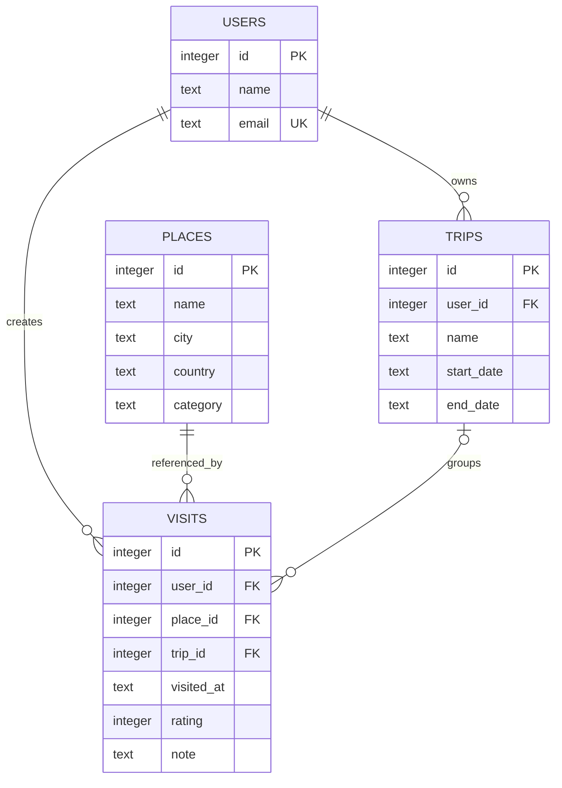

# Отчет по практической работе 3

## Общие сведения

Дисциплина: Технологии разработки приложений на базе фреймворков

Тема индивидуального проекта: Система учета посещенных мест

Рабочее название: Visited Places

Группа: не указано

ФИО студента: не указано

Год выполнения: 2026

## Цель работы

Цель ПР3 - описать модель данных проекта: сущности, атрибуты, связи, ключи,
ограничения, индексы, нормализацию, возможную денормализацию, оптимизацию и
подходы к безопасности. Рабочее консольное приложение использует постоянное
SQLite-хранилище, а JSON остается форматом начальных данных и программного
импорта/экспорта. SQL-схема реализована в `database/schema.sql`; версия схемы
задана через `PRAGMA user_version = 1`.

## Сущности

### User

Пользователь журнала посещенных мест.

| Поле | Тип в Python | Тип в SQLite | Ограничения |
| --- | --- | --- | --- |
| `id` | `int` | `INTEGER` | `PRIMARY KEY` |
| `name` | `str` | `TEXT` | `NOT NULL`, непустое значение |
| `email` | `str` | `TEXT` | `NOT NULL`, `COLLATE NOCASE`, `UNIQUE`, непустое значение |

В Python-классе `User` email дополнительно проверяется регулярным выражением.
SQL-схема не проверяет формат email: на уровне SQLite задано только непустое
значение и уникальность с `COLLATE NOCASE`.

### Place

Место, которое можно посетить.

| Поле | Тип в Python | Тип в SQLite | Ограничения |
| --- | --- | --- | --- |
| `id` | `int` | `INTEGER` | `PRIMARY KEY` |
| `name` | `str` | `TEXT` | `NOT NULL`, `COLLATE NOCASE`, непустое значение |
| `city` | `str` | `TEXT` | `NOT NULL`, `COLLATE NOCASE`, непустое значение |
| `country` | `str` | `TEXT` | `NOT NULL`, `COLLATE NOCASE`, непустое значение |
| `category` | `str` | `TEXT` | `NOT NULL`, непустое значение |

Уникальность места задается сочетанием `name`, `city`, `country`.

Ограничение SQLite: стандартный `NOCASE` покрывает ASCII и не полностью
повторяет поведение Python `casefold()` для кириллицы. В Python-сервисе
уникальность email и мест проверяется через `casefold()`. При развитии
веб-версии нужно выбрать единую стратегию нормализации строк для приложения и
базы данных.

### Trip

Поездка пользователя.

| Поле | Тип в Python | Тип в SQLite | Ограничения |
| --- | --- | --- | --- |
| `id` | `int` | `INTEGER` | `PRIMARY KEY` |
| `user_id` | `int` | `INTEGER` | `NOT NULL`, `FOREIGN KEY` на `users.id` |
| `name` | `str` | `TEXT` | `NOT NULL`, непустое значение |
| `start_date` | `str` | `TEXT` | `NOT NULL`, формат `YYYY-MM-DD` |
| `end_date` | `str` | `TEXT` | `NOT NULL`, формат `YYYY-MM-DD`, не раньше `start_date` |

### Visit

Отметка о посещении места.

| Поле | Тип в Python | Тип в SQLite | Ограничения |
| --- | --- | --- | --- |
| `id` | `int` | `INTEGER` | `PRIMARY KEY` |
| `user_id` | `int` | `INTEGER` | `NOT NULL`, `FOREIGN KEY` на `users.id` |
| `place_id` | `int` | `INTEGER` | `NOT NULL`, `FOREIGN KEY` на `places.id` |
| `trip_id` | `int \| None` | `INTEGER` | `FOREIGN KEY` на `trips.id`, допускает `NULL` |
| `visited_at` | `str` | `TEXT` | `NOT NULL`, формат `YYYY-MM-DD HH:MM` |
| `rating` | `int \| None` | `INTEGER` | `NULL` или значение от 1 до 5 |
| `note` | `str` | `TEXT` | `NOT NULL`, по умолчанию пустая строка |

Уникальность отметки задается сочетанием `user_id`, `place_id`, `visited_at`.

## Связи

- Один пользователь может иметь много поездок.
- Один пользователь может иметь много отметок.
- Одно место может встречаться во многих отметках.
- Одна поездка может содержать много отметок.
- Отметка может не относиться к поездке, поэтому `trip_id` допускает `NULL`.

## Ключи и индексы

Основные ключи:

- `users.id`;
- `places.id`;
- `trips.id`;
- `visits.id`.

Внешние ключи:

- `trips.user_id -> users.id ON DELETE CASCADE`;
- `visits.user_id -> users.id ON DELETE CASCADE`;
- `visits.place_id -> places.id ON DELETE RESTRICT`;
- `visits.trip_id -> trips.id ON DELETE SET NULL`.

Уникальные ограничения:

- `users.email COLLATE NOCASE`;
- `places(name, city, country)` с `COLLATE NOCASE` на текстовых полях;
- `visits(user_id, place_id, visited_at)`.

Индексы действующей SQLite-схемы:

- `idx_places_city_country` по `city`, `country`;
- `idx_trips_user_dates` по `user_id`, `start_date`, `end_date`;
- `idx_visits_user_date` по `user_id`, `visited_at DESC`;
- `idx_visits_place` по `place_id`;
- `idx_visits_trip` по `trip_id`.

## Проверки DDL

Схема SQLite поддерживает проверки:

- положительные идентификаторы;
- непустые текстовые поля через `length(trim(...)) > 0`;
- канонические даты поездок в формате `YYYY-MM-DD`;
- каноническую дату и время отметки в формате `YYYY-MM-DD HH:MM`;
- диапазон поездки `start_date <= end_date`;
- рейтинг `NULL` или целое число от 1 до 5;
- уникальность email, места и отметки.

## SQL-триггеры

В `database/schema.sql` реализованы три триггера:

- `check_visit_trip_insert` - перед добавлением отметки проверяет, что поездка
  принадлежит тому же пользователю, а дата посещения входит в диапазон поездки;
- `check_visit_trip_update` - выполняет ту же проверку при изменении `user_id`,
  `trip_id` или `visited_at` у отметки;
- `check_trip_visits_update` - запрещает менять владельца поездки или сужать
  даты поездки, если это сделает уже существующие отметки конфликтующими.

В сервисе `TravelJournal` реализованы `update_trip(user_id, trip_id, *, name,
start_date, end_date)` и `remove_trip(user_id, trip_id)`. Изменение проверяет
владельца и новый диапазон всех связанных посещений: существующие отметки
нельзя вывести за пределы поездки. Удаление снимает связь `trip` с посещений,
но сохраняет сами отметки. В SQLite этому соответствует `ON DELETE SET NULL`.

Сервисные проверки действуют при работе с объектами журнала, а триггеры и
внешние ключи обеспечивают согласованность при записи в БД. Сценарии изменения
поездки проверяются в тестах сервиса и схемы.

## Нормализация

Модель близка к третьей нормальной форме, но содержит контролируемую
избыточность:

1. Поля атомарны: город, страна, категория, дата и рейтинг хранятся отдельно.
2. Неключевые атрибуты зависят от полного ключа своей таблицы.
3. Данные места не дублируются в отметке, а связи с местами и поездками
   задаются идентификаторами.

Особенность модели `Visit`: поле `user_id` хранится всегда, потому что отметка
может существовать без поездки. Если `trip_id` не `NULL`, поездка уже определяет
владельца через `trips.user_id`, поэтому возникает контролируемая избыточность
`visits.user_id`. Это осознанный выбор минимальной модели из четырех сущностей:
он упрощает личную историю посещений и отметки вне поездок. Согласованность
проверяют сервис `TravelJournal` и три SQL-триггера. При строгом разложении
можно вынести связь отметки с поездкой в отдельную таблицу.

SQLite и JSON сохраняют связи через идентификаторы. При загрузке
идентификаторы преобразуются в объектные ссылки.

## Возможная денормализация

Дополнительная денормализация на текущем этапе не требуется. При росте нагрузки можно
рассмотреть:

- хранение счетчиков посещений по пользователю;
- материализованную статистику по странам и городам;
- кэш средней оценки пользователя.

Эти значения должны пересчитываться при добавлении, изменении или удалении
отметок, иначе появится риск рассинхронизации.

## Реализовано и планы развития

Реализовано в рабочем консольном приложении:

- объектная модель `User`, `Place`, `Trip`, `Visit`;
- сервис `TravelJournal`, включая изменение и удаление поездок;
- интерактивное меню `ConsoleApplication` с локальными профилями;
- SQLite-загрузка и транзакционное сохранение через `JournalDatabase`;
- JSON-загрузка и JSON-сохранение для начальных данных и программного импорта/экспорта;
- поиск, сортировка и статистика;
- проверки дат, рейтингов, внешних ключей, владельца поездки и дублей;
- DDL SQLite с таблицами, ограничениями, индексами и тремя триггерами;
- замена рабочего журнала копией только после успешного сохранения;
- обработка ошибок меню, EOF и `Ctrl+C`.

Проектируется для следующих этапов:

- монолитное веб-приложение;
- авторизация и личные кабинеты;
- HTTPS;
- шифрование чувствительных данных и секретов;
- кэширование статистики;
- выборочные SQL-запросы и обновления вместо полного снимка журнала;
- контроль конкурентных изменений для нескольких веб-запросов.

## SQLite-хранилище

Схема `database/schema.sql` совместима со SQLite из стандартной библиотеки
Python. В ней есть таблицы `users`, `places`, `trips`, `visits`, внешние ключи,
ограничения `UNIQUE` и `CHECK`, индексы для частых запросов и триггеры для
проверки межтабличных правил. Проверки DDL находятся в `tests/test_schema.py`.
В конце DDL задано `PRAGMA user_version = 1`; загрузка и сохранение через
`JournalDatabase` проверяют совместимость версии схемы.

`JournalDatabase(path)` в `visited_places/database.py` подключает эту схему к
приложению. Интерфейс хранилища:

| Элемент | Назначение |
| --- | --- |
| `exists` | Свойство `bool`: существует ли файл базы |
| `initialize(journal)` | Создать SQLite-базу по схеме версии 1 и записать начальный снимок журнала |
| `load() -> TravelJournal` | Загрузить четыре коллекции и восстановить объектные ссылки |
| `save(journal)` | Сохранить четыре коллекции в одной транзакции |

По умолчанию файл базы находится в `data/journal.sqlite3` рядом с `main.py`.
Аргумент `--data-dir PATH` позволяет выбрать отдельный каталог данных; в нем
используется такой же файл `journal.sqlite3`.

При наличии базы программа загружает данные только из SQLite. Начальные JSON
не перезаписывают существующую базу. Если базы нет, полный набор `users.json`,
`places.json`, `trips.json`, `visits.json` служит начальным журналом. Отсутствие
всех четырех файлов означает пустой журнал, а отсутствие части файлов - ошибку
запуска без автоматического восстановления. В пустом журнале консольное меню
предлагает создать первого пользователя.

Каждая изменяющая операция применяется к `deepcopy` рабочего журнала.
`ConsoleApplication._commit` сохраняет копию через `JournalDatabase.save` и
только после успеха заменяет рабочий журнал. При ошибке сохраняется прежнее
состояние в памяти, транзакция не оставляет частично записанный снимок.
Это механизм реального сохранения пользовательских изменений.
Перед инициализацией и сохранением вызывается `journal.validate()`, поэтому
проверяются также объекты, измененные напрямую вне сервисных методов.

JSON-функции в `visited_places/storage.py` доступны для программного
импорта/экспорта и начальной загрузки. Отдельных пунктов импорта/экспорта в меню
нет. Проверки SQLite-хранилища находятся в `tests/test_database.py`, а сценарии
меню - в `tests/test_cli.py`. Интеграционная проверка текущей версии:
`pytest==8.3.3` - `117 passed`, `flake8==7.1.1` - без замечаний.

## Оптимизация

Журнал загружается из SQLite в память; поиск, история и статистика выполняются
по коллекциям объектов. Сохранение записывает полный снимок четырех коллекций
в одной транзакции. Это приемлемо для небольшого локального журнала. Индексы
уже есть в схеме, но не ускоряют линейный проход по Python-спискам. Для большого
объема данных нужны:

- использование существующих индексов при выборочных SQL-запросах;
- пагинация списка отметок;
- фильтры по городу, стране, категории и периоду;
- кэширование агрегированной статистики;
- отдельные запросы для часто используемых отчетов;
- запись только измененных строк и контроль конкурентных обновлений.

Текущий режим - один экземпляр CLI для одной базы. Полные снимки не обеспечивают
согласование изменений нескольких параллельных сеансов, поэтому такой режим
не поддерживается как готовая возможность приложения.

## Безопасность

В текущем консольном приложении нет сетевого доступа и авторизации. Выбор
локального профиля в меню не является входом по паролю. Переданный
`user_id` не является аутентификацией или реальной границей доступа:
произвольный вызывающий код может выбрать любой идентификатор пользователя.
Приложение проверяет согласованность связей и не позволяет смешивать владельца
поездки с владельцем отметки, но не подтверждает личность пользователя.

SQLite хранит реальные пользовательские данные локально. Доступ к файлу базы и
резервным копиям определяется правами операционной системы. Шифрование файла
БД не реализовано. Транзакции защищают целостность записи, но не заменяют
аутентификацию и не гарантируют приватность между локальными профилями.
При вставке значения передаются в SQLite через именованные параметры;
названия таблиц берутся из фиксированного списка приложения. Внешние ключи
включаются для каждого соединения через `PRAGMA foreign_keys = ON`.

Для веб-версии требуется:

- хранить пароли только в виде безопасных хешей;
- использовать HTTPS;
- брать `user_id` из подтвержденной сессии, а не из произвольного параметра;
- проверять, что пользователь работает только со своими поездками и отметками;
- защищать формы от CSRF;
- валидировать все входные данные на сервере;
- не хранить секреты в репозитории;
- ограничивать доступ к резервным копиям и логам.

## Вывод

В ПР3 описана модель данных Visited Places. Сущности представлены таблицами и
классами, связи заданы через идентификаторы, а ограничения, индексы и триггеры
SQLite реализованы. Основное приложение работает с реальной SQLite-базой,
сохраняет изменения между запусками и предоставляет интерактивное меню.
JSON используется для начальных данных и программного импорта/экспорта,
а веб-интерфейс, авторизация и HTTPS остаются планами развития.
